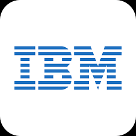

## ✍ My Objective:

Striving to contribute efficiently and effectively, adding value to the employer to achieve organizational goals. Aiming to enhance personal knowledge and grow alongside the employer

 
  

## 👜 Total Experience:
Having total experience of 4+ Years till date.

## 📖 Profile Summary and Areas of Expertise:

Knowledgeable Data Engineer with robust background in data architecture and pipeline development. Proven ability to streamline data processes and enhance data 
integrity through innovative solutions. Demonstrates advanced proficiency in SQL and Python, leveraging these skills to support cross-functional teams and drive data
driven decision-making.

## 🌐 Socials:
 

## 💻 Tech Skills:

 
  
  

## 💼 Work Experience:

###   Cognizant, Noida

Domain: - Finance  
Client: - NA  
Duration: - January-2025 - Year Till date

###   Cognizant, Noida

Domain: - Finance  
Client: - American Express  
Duration: - Nov-2023 - January-2025

###  Optum Global Solutionns, Noida

Domain: - HealthCare  
Project: - Speech Analytics  
Duration: - May-2022 – Sep-2023

###  EXL Services, Noida

Domain: - HealthCare  
Client: - Aetna  
Duration: -Aug-2020 – May-2022

## 🎓 Educational Qualification:
|     Degree      |  University/Board |                Institute               | Year of Passing |
|:----------------|:-----------------:|:--------------------------------------:|---------------: |
| **MCA**         |      Jamia        | Jamia Millia Islamia                   |      2020       |
| **BCA**         |      TMU          | Teerthanker Mahaveer University        |      2017       |
| **12th**        |      C.B.S.E      | PMS Public School                      |      2014       |
| **10th**        |      C.B.S.E      | PMS Public School                      |      2012       |

## 📋 Strength:
•	Demonstrates strong analytical skills  
•	Adapts easily to change  
•	Displays a curious mindset and a willingness to learn new concepts  
•	Proven proficiency in problem-solving
